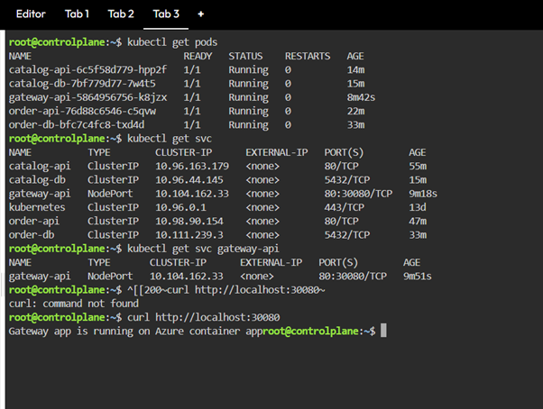

# miniorder-cloudnative-dotnet
A hands-on cloud-native .NET portfolio project covering microservices, Docker, Docker Compose, integration testing, Azure Container Apps, and Kubernetes.

## Tech Stack

- .NET 8
- ASP.NET Core Web API
- Docker
- Docker Compose
- PostgreSQL
- EF Core
- YARP API Gateway
- xUnit
- Azure Container Apps
- Kubernetes

## Project Overview

This project demonstrates a cloud-native .NET microservices setup with:

- Catalog API
- Order API
- YARP API Gateway
- PostgreSQL databases
- Docker Compose for local orchestration
- Integration testing
- Azure Container Apps deployment
- Kubernetes manifests in `/k8s`

## Architecture
```text
Client / Postman
       |
       v
   API Gateway (YARP)
    /             \
   v               v
Catalog API      Order API
   |               |
   v               v
Catalog DB       Order DB

```
## Services

### Catalog Service
- Swagger: `/swagger`
- GET `/api/v1/products`
- GET `/api/v1/products/{id}`
- POST `/api/v1/products`

### Order Service
- Swagger: `/swagger`
- POST `/api/v1/orders`
- GET `/api/v1/orders/{id}`

### Gateway
- `/catalog/*` -> Catalog Service
- `/orders/*` -> Order Service
- `/health` -> Gateway health check


## Local Run

### Build and run with Docker Compose

```bash
docker compose up --build
```

### Stop containers

```bash
docker compose down
```

### Stop containers and delete volumes

```bash
docker compose down -v
```

## Earlier Docker Practice Notes

These commands were used during my initial Docker learning with a standalone `Catalog.Api` project. This is kept only as an early learning reference and is not part of the final microservices architecture.

```bash
docker build -t catalog-api -f src/Catalog.Api/Dockerfile .
docker run --rm -e ASPNETCORE_ENVIRONMENT=Development -p 8080:8080 catalog-api
```
### Swagger for this standalone practice project: 
 Open `/swagger`

## Database Setup

- `catalog-db` for Catalog Service
- `order-db` for Order Service

Inside Docker network, services use:

- `catalog-db:5432`
- `order-db:5432`

Local mapped ports:

- `catalog-db` -> `localhost:5433`
- `order-db` -> `localhost:5434`

EF Core migrations are applied on startup using `Database.Migrate()`.

## Gateway (YARP)

Implemented an API Gateway using YARP to provide a single public entry point for backend services.

### Completed
- Added API Gateway project using YARP
- Configured reverse proxy routes for Catalog and Order services
- Added `/health` endpoint
- Verified routing through gateway
- Tested endpoints successfully in Postman

## Integration Testing

A separate integration test project was added to verify API behavior using real HTTP endpoints.

### Covered scenarios
- Catalog API GET endpoint
- Order API POST endpoint
- Order API GET by ID endpoint
- Service-to-service validation from Order API to Catalog API

### Technologies used
- xUnit
- `Microsoft.AspNetCore.Mvc.Testing`
- `WebApplicationFactory<Program>`
- `HttpClient`
- FluentAssertions

### Test command

```bash
dotnet test
```

## Azure Container Apps

As part of Azure learning, the application was deployed to Azure Container Apps.

### Deployed components
- Gateway App
- Catalog API
- Catalog DB container

### Key activities
- Built Docker images
- Pushed images to Azure Container Registry
- Deployed to Azure Container Apps
- Configured secrets and environment variables
- Checked logs for troubleshooting
- Understood revisions after updates

## Kubernetes

Kubernetes manifests are available in the `/k8s` folder.

### Files added
- `catalog-deployment.yaml`
- `catalog-service.yaml`
- `order-deployment.yaml`
- `order-service.yaml`
- `gateway-deployment.yaml`
- `gateway-service.yaml`
- `catalog-db-deployment.yaml`
- `catalog-db-service.yaml`
- `order-db-deployment.yaml`
- `order-db-service.yaml`

Basic readiness and liveness probes were also added.

### Verification commands

```bash
kubectl get pods
kubectl get svc
kubectl get deployments
```

### Screenshot proof



## Key Learning Outcome

This project helped me understand how to build and run cloud-native .NET microservices locally with Docker Compose, expose them through a YARP API Gateway, test them through integration testing, deploy them to Azure Container Apps, and define them conceptually in Kubernetes using Deployments and Services.

